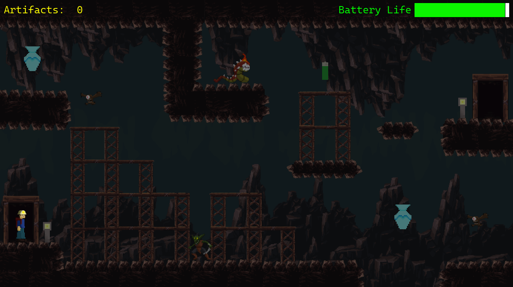

# Abyssmal (Prototype)
## 📖 Game Overview
After discovering Flint has gone missing on their archaeology expedition, Jasper must venture into the abyss to find him. Collect Batteries to replenish your Battery Life and as an archaeologist, artifacts to improve your score! Available on itch.io to play in-browser or to download as an executable (Windows Only).

## Team
> Games Developer: CFY

## Gameplay Loop
```
Start Demo
├── Play Game
|     Tutorial
|     ├── Levels 1–3
|     │   └── On Fail
|     │       ├── Continue
|     │       └── Bad Ending
|     └── Good Ending
|
└── Exit Game
```

## ✨ Features

- **Character Navigation** — Keyboard-driven movement with object interaction across doors, collectibles, enemies, and the NPC Chalk.
- **NPC Dialogue System** — Tutorial sequence where Chalk guides the player through controls and game setup.
- **Collision Detection** — Vertical and horizontal checks to resolve object obstruction along the player's path.
- **Enemy AI** — Distance-based detection using the Pythagorean theorem to trigger combat and manage layering within attack range.
- **Dual-Purpose HUD** — A dynamic timer doubles as the health bar, with progressive environmental darkening as time decreases for tension and visual feedback.
- **Replenishing Mechanic** — Collectible batteries extend the timer by 30 seconds, rewarding exploration.
- **Branching Narrative** — Failure states offer a continue/give up choice leading to distinct good and bad endings, with a main menu as the entry branching point.
- **Checkpoint System** — New instances spawned on continuation or out-of-bounds events to manage player respawning across levels.
- **Artifact Score** — Real-time score counter updated on collectible interaction.

## 🎮 Controls
- **Left Key**: Movees the player to the left.
- **Right Key**: Moves the player to the right.
- **Spacebar**: Allows the player to jump.
- **Enter**: Triggers collision event with doors.
- **Control Key**: For interactions with Chalk.

## Installation
Please see [Abyssmal Demo](https://h5h5.itch.io/abyssmal-demo)

## ⛏️ Built With
- **GameMaker**: Utilised tilemaps, objects, timers and collision events to develop the gameplay loops and UI.
- **Aseprite**: Developed the playable character, light, and collectibles spritesheets for GameMaker.
- **Additional Sources**
- `GameDevMarket` — Additional sprites, music, and background images.

## 📄 License
All Rights Reserved.
